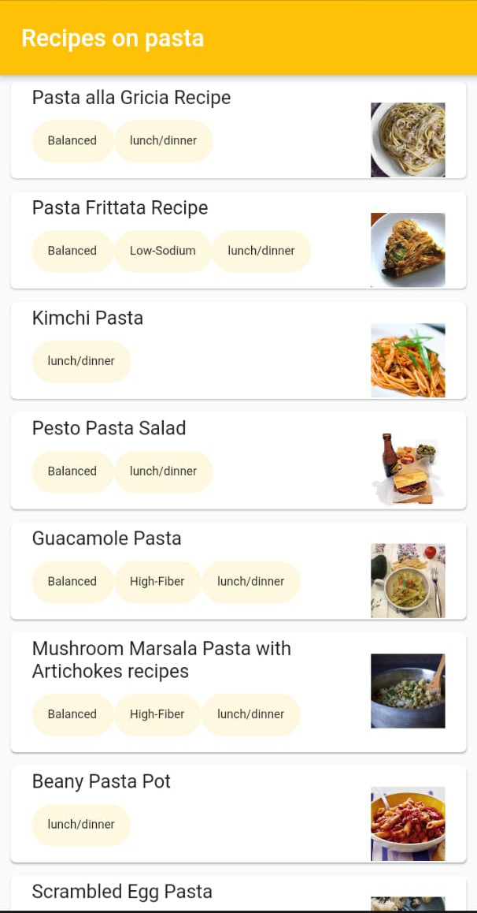
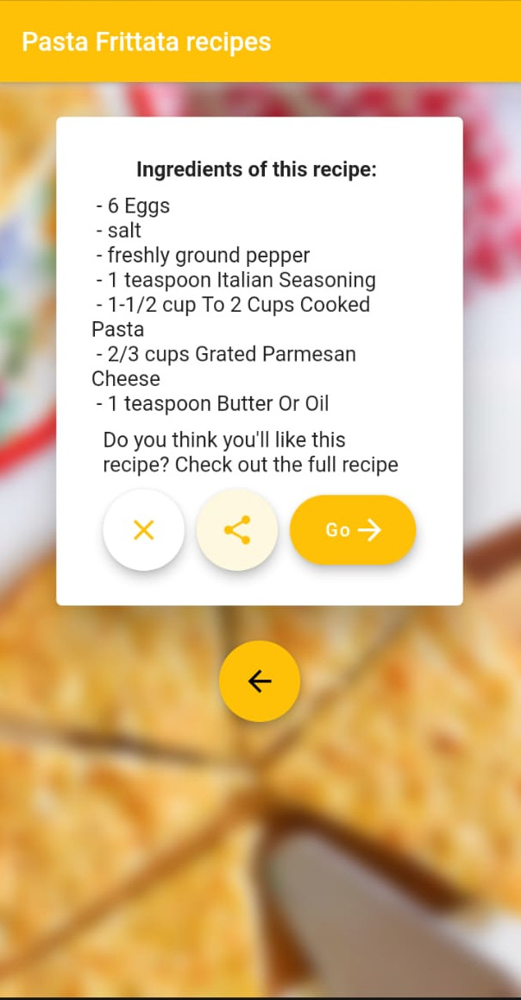

# Tasty Recipes

Search for recipes, view them and share it via all your social media apps!

 <p float="left">

  
  
  

</p>


## How to use?
Clone this repository
```
git clone https://github.com/Paarkesh/TastyRecipes.git
```

Open this repository in your favourite editor.
Wait till the editor sets the project up and then use the following command to install all the dependencies
``` 
flutter pub get
```

Get an API key from [Edamam Recipe API](https://developer.edamam.com/edamam-recipe-api), add it to a `config.dart` in `lib/` as shown:

```
YOUR_APP_ID = "the app ID"
YOUR_APP_KEY = "your app key"
```

Connect your device or an emulator and run the application either by using  button, or by using 
```flutter run```

